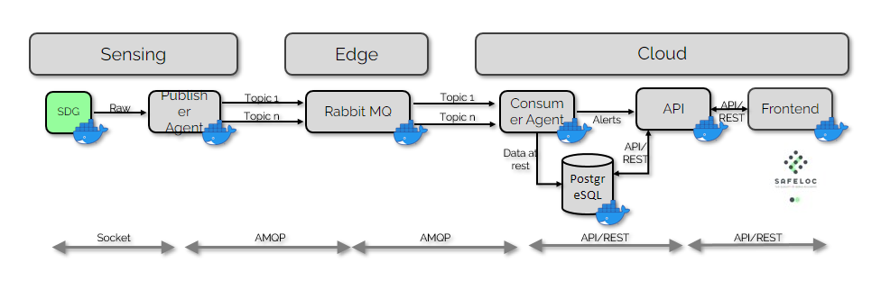

# csv data sender

# csv data sender for safeloc project

- [csv data sender for safeloc project](#csv-data-sender-for-safeloc-project)
  - [Contributors](#contributors)
  - [Description](#description)
  - [Architecture](#architecture)
  - [How to use](#how-to-use)

## Contributors

- **Íñigo Juarros**  - [ijuarrosu](ijuarrosu@ceit.es)

## Description

A small script designed to replace the [Synthetic Data Generator](https://git.unav.edu/daim/safeloc/synthetic-data-generator) for testing/devepment purposes, to do that the programm reads data from a .csv file and sends it to the [Publisher agent](https://git.unav.edu/daim/safeloc/publisher_agent) via socket in the same format used by the [Synthetic Data Generator](https://git.unav.edu/daim/safeloc/synthetic-data-generator).

## Architecture



## Generate data

The scrip will take the data from the .csv file on the main directory, to generate a compatible file use the ``trazar ruta`` option in the analisis page from the the [frontend](https://git.unav.edu/daim/safeloc/frontend), draw your route and press the ``Guardar ruta`` button, this will download a csv file, take that file and place it in the same folder as the ``reader.py`` file.

## How to use

To launch the program using docker simply place your terminal in the project folder and run the following command

```bash
docker-compose up
```
